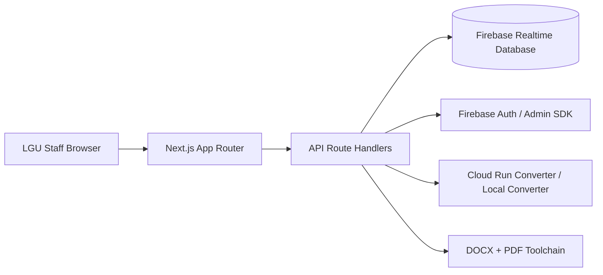

# eBOSS Sabangan: Project Documentation

> Version date: 2026-03-18
>
> This document is a maintainer-focused reference for architecture, modules, API routes, environment variables, and operational workflows.

## 1) Project Overview

**eBOSS Sabangan** is a Next.js-based LGU platform that unifies:

- Business application intake and requirement review
- Mayor's Clearance document processing
- Treasury fee assessment and payment metadata tracking
- Admin user management utilities
- LGU status and event publishing

The system is optimized for document-heavy workflows (DOCX/PDF generation and conversion) and Firebase-backed data operations.

## 2) Core Architecture



### Runtime Model

- **Frontend + API**: Next.js App Router (`app/*`, `app/api/*`)
- **Primary backend data**: Firebase Realtime Database
- **Authentication**: Firebase Auth (+ server-side validation path)
- **Document pipeline**:
  - DOCX templating (`docxtemplater`, `pizzip`)
  - PDF composition/merge (`pdf-lib`)
  - Spreadsheet export (`exceljs`)
  - DOCX rendering preview (`docx-preview`)
- **Conversion microservice**: Dockerized Express + LibreOffice in `cloud-run-converter`

## 3) Functional Modules

### Staff Workspace (`/`)

- Staff login and access control checks
- Application search/filter/status lifecycle
- Requirement-level file review and decisioning
- Integrated messaging and file-aware interactions

### Requirement Review (`/client/[id]`)

- Uploaded requirement inspection
- Approve/reject with notes
- Document preview and print flow
- Payment visibility integration (treasury data)

### Mayor's Clearance

- Clearance application review and requirements verification
- Template-driven and export-ready output handling
- Records generation workflows (periodized outputs)

### LGU Status (`/lgu-status`)

- Office status and advisory publication
- Mayor availability timeline/state publishing
- Event card management (featured + upcoming)

### Admin (`/admin`)

- Staff and treasury user administration
- Business application cleanup endpoints/tools

### Treasury (`/treasury`)

- Fee assessment calculation route integration
- Cedula and Official Receipt data handling

## 4) API Routes (App Router)

The following are implemented under `app/api/*`.

| Endpoint | Methods | Purpose |
|---|---|---|
| `/api/health` | `GET` | Service health check |
| `/api/local-users` | `GET` | Local/users data retrieval helper |
| `/api/local-business` | `GET` | Local/business data retrieval helper |
| `/api/proxy` | `GET` | Proxy utility endpoint |
| `/api/admin/users` | `GET`, `POST`, `PATCH`, `DELETE` | Admin CRUD/maintenance operations for users |
| `/api/admin/business-applications` | `GET`, `DELETE` | Admin query and cleanup for business applications |
| `/api/treasury/fees` | `POST` | Treasury fee assessment computation |
| `/api/clearance-files` | `GET`, `POST`, `DELETE` | Mayor's clearance requirement file operations |
| `/api/export/docx` | `POST` | DOCX generation/export |
| `/api/export/docx-to-pdf` | `POST` | DOCX-to-PDF conversion bridge |
| `/api/export/application-docs` | `POST` | Application document bundle/export |
| `/api/export/clearance-docx` | `POST` | Clearance DOCX generation |
| `/api/export/clearance-pdf` | `POST` | Clearance PDF conversion/export |
| `/api/export/clearance-template` | `GET` | Clearance template fetch |

## 5) Environment Variables

### Required (App)

| Variable | Description |
|---|---|
| `NEXT_PUBLIC_FIREBASE_API_KEY` | Firebase Web config API key |
| `NEXT_PUBLIC_FIREBASE_AUTH_DOMAIN` | Firebase auth domain |
| `NEXT_PUBLIC_FIREBASE_PROJECT_ID` | Firebase project ID |
| `NEXT_PUBLIC_FIREBASE_STORAGE_BUCKET` | Firebase storage bucket |
| `NEXT_PUBLIC_FIREBASE_MESSAGING_SENDER_ID` | Firebase messaging sender ID |
| `NEXT_PUBLIC_FIREBASE_APP_ID` | Firebase app ID |
| `NEXT_PUBLIC_FIREBASE_DATABASE_URL` | Realtime Database base URL |

### Strongly Recommended

| Variable | Description |
|---|---|
| `NEXT_PUBLIC_FIREBASE_DATABASE_NAMESPACE` | DB namespace prefix (`users/webapp` default pattern) |
| `CONVERTER_SERVICE_URL` | Absolute converter endpoint, commonly `/convert/docx-to-pdf` |

### Optional (Cache + Converter fallback)

| Variable | Description |
|---|---|
| `REDIS_URL` | Redis connection URL |
| `UPSTASH_REDIS_URL` | Alternative Redis URL |
| `KV_URL` | Additional compatible Redis URL |
| `PREVIEW_FORM_CACHE_TTL_SECONDS` | Cache TTL for generated previews |
| `PREVIEW_FORM_CACHE_VERSION` | Cache key versioning |
| `CONVERTER_BASE_URL` | Base converter URL fallback |
| `NEXT_PUBLIC_CONVERTER_SERVICE_URL` | Public converter URL fallback |

### Admin SDK Credentials (local/dev scenarios)

| Variable | Description |
|---|---|
| `FIREBASE_ADMIN_SERVICE_ACCOUNT_PATH` | File path to service account JSON |
| `GOOGLE_APPLICATION_CREDENTIALS` | Standard ADC path |
| `FIREBASE_ADMIN_SERVICE_ACCOUNT_JSON` | Inline JSON credentials |

## 6) Converter Service (`cloud-run-converter`)

### Purpose

Runs LibreOffice headless conversion in an isolated service to avoid shipping heavy conversion dependencies directly in the Next.js runtime.

### Endpoints

| Endpoint | Method | Input |
|---|---|---|
| `/health` | `GET` | none |
| `/convert/docx-to-pdf` | `POST` | multipart `file` |
| `/convert/image-to-pdf` | `POST` | multipart `file` |
| `/convert/images-to-pdf` | `POST` | multipart `files[]` |

### Local Run

```bash
cd cloud-run-converter
npm install
npm start
```

### Local Docker Run

```bash
cd cloud-run-converter
docker build -t eboss-converter .
docker run --rm -p 8080:8080 --name eboss-converter eboss-converter
```

## 7) Hosting and Rewrite Behavior

Configured in `firebase.json`:

- Firebase Hosting serves the app
- `/api/convert/**` is rewritten to Cloud Run service `converter` in region `asia-southeast1`

This keeps conversion requests under the same site domain while delegating heavy processing to Cloud Run.

## 8) Build, Run, and Deploy

### Local development

```bash
npm run dev
```

### Build and serve

```bash
npm run build
npm run start
```

### Lint

```bash
npm run lint
```

### Hosting deploy

```bash
firebase deploy --only hosting
```

## 9) Directory Guide

| Path | Role |
|---|---|
| `app/` | Pages, layouts, and route handlers |
| `app/api/` | Server endpoints for admin, export, treasury, and utility flows |
| `components/` | Reusable UI components and module-specific widgets |
| `database/` | Firebase database access helpers |
| `lib/` | Integrations and utility modules (PDF/export/Redis/admin setup) |
| `cloud-run-converter/` | Converter microservice source and Dockerfile |
| `public/templates/` | Static template assets |
| `docs/screenshots/` | UI documentation media |

## 10) Operational Notes

- Keep converter endpoint health-tested before enabling export-heavy workflows.
- For production, avoid storing local Windows credential paths in deployed `.env` values.
- When changing Firebase project/environment, update both web config and admin credential strategy.
- Validate rewrite behavior after converter redeploys.

## 11) Common Issues and Fixes

| Symptom | Likely Cause | Resolution |
|---|---|---|
| DOCX to PDF fails with 500/502 | Converter unavailable or misconfigured URL | Check converter `/health` and `CONVERTER_SERVICE_URL` |
| Firebase Admin initialization error | Missing/invalid service account env vars | Set `FIREBASE_ADMIN_SERVICE_ACCOUNT_PATH` or JSON credential env |
| Database reads fail | Missing/incorrect DB URL/namespace | Verify `NEXT_PUBLIC_FIREBASE_DATABASE_URL` and namespace env vars |
| Export latency spikes | Converter cold starts or large files | Keep service warm, validate resource limits/timeouts |

---

Maintainer recommendation: keep this file in sync whenever route handlers, environment contracts, or deployment topology change.
